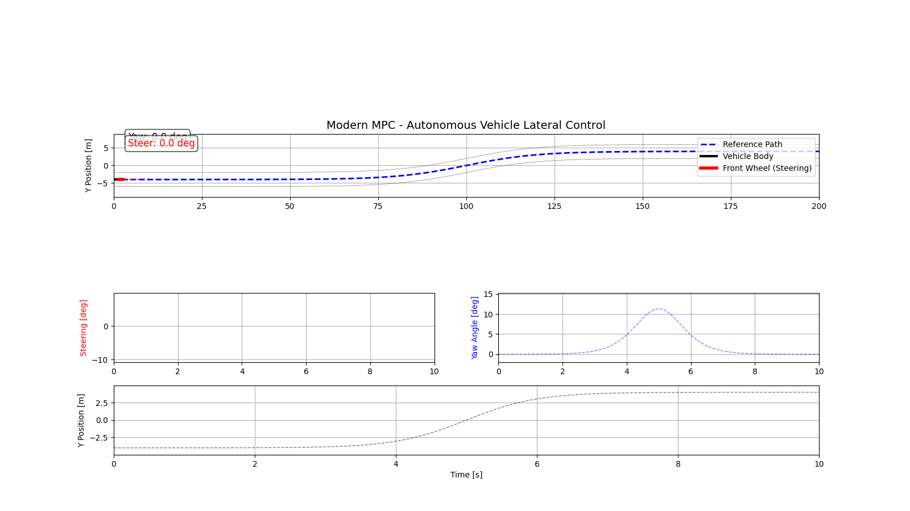

#  Model Predictive Control (MPC) for Autonomous Vehicle Lateral Dynamics

*A complete MPC-based lateral control and animation simulation in
Python*

This repository contains a Model Predictive Controller for a
lateral dynamics of the autonomous vehicle through a linearized bicycle model.
It creates a smooth double lane-change reference, calculates MPC
prediction matrices from scratch, optimizes steering, and
shows the vehicle's motion.

------------------------------------------------------------------------
## Features

– Model Predictive Control for Lateral Vehicle Dynamics
- Linear bicycle model
- Conversion from continuous to discrete time using Zero-Order Hold
- Prediction matrices Φ, Γ, H, and M
- Tanh-based reference for a double lane-change maneuver
- Real-time visualization/animations
- Steering saturation to ±30°
- Pure NumPy & SciPy code

------------------------------------------------------------------------

## Technical Overview

### Vehicle Model States

-   `v_y` -- lateral velocity
-   `ψ` -- yaw angle
-   `ψ̇` -- yaw rate
-   `Y` -- lateral position

It includes parameters such as mass, inertias, cornering stiffness, geometry, and velocity.

### MPC

-   Adjustable horizon
-   Δu formulation
-   Quadratic cost
-   Enforcement of steering limits
-   Closed-form optimal input calculation

### Simulation

-   'solve_ivp' numerical integration
-   Time step: 0.05 s (recommended)
-   Steering and vehicle path visualization

## How to Run

### 1. Create environment

``` bash
python -m venv .venv
source .venv/bin/activate
```

### 2. Install dependencies

``` bash
pip install -r requirements.txt
```

### 3. Run notebook

``` bash
jupyter notebook mpc_vehicle_control.ipynb
```

------------------------------------------------------------------------

## Dependencies

    numpy
    scipy
    matplotlib
    ipython
    jupyter

------------------------------------------------------------------------

### Results


------------------------------------------------------------------------

## Author
Ömer Faruk Özbektaş
